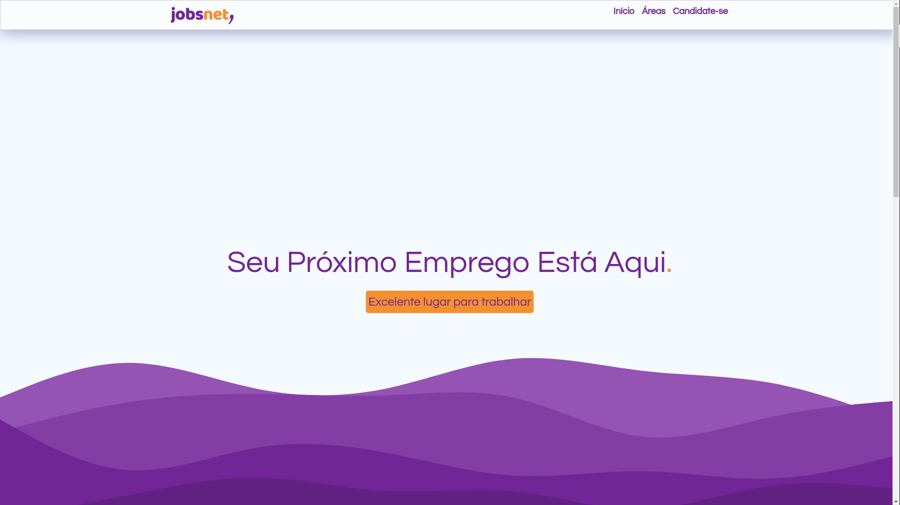
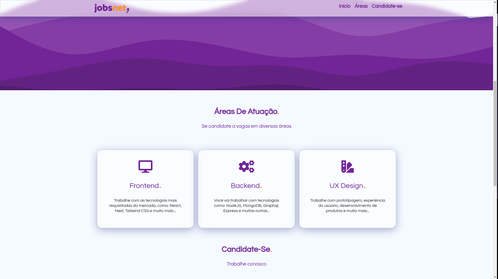
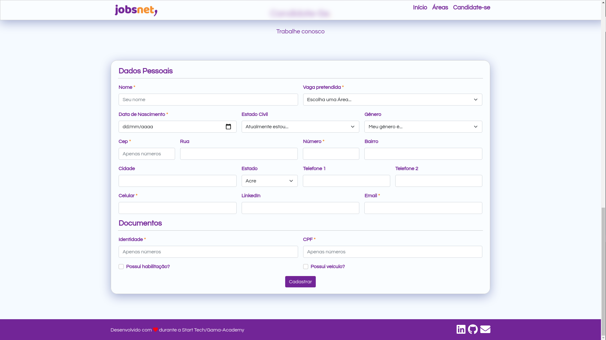

## Antes de tudo o link para o Backend desse projeto
- [Link para o Back-end do projeto](https://github.com/Augusto-Neves/jobsnet-backend)
- [Link para onde o front-end está hospedado](https://jobsnet-frontend.vercel.app/)

<br>
<p align="center">
  

     
</p>

<h1 align="center">
    
</h1>
<h1 align="center">
    
</h1>
<h1 align="center">
    
</h1>

<br>

## 🧪 Tecnologias

Esse projeto foi desenvolvido durante a Start Tech Gama Academy usando as seguintes tecnologias:

-Front-End
- [React](https://reactjs.org)
- [React-Router](https://reactrouter.com/)
- [styled-components](https://styled-components.com/)
- [bootstrap](https://getbootstrap.com.br/)
- [axios](https://axios-http.com/)
- [react-hot-toast](https://react-hot-toast.com/)

-Back-end
- [Node](https://nodejs.org/)
- [CORS](https://www.npmjs.com/package/cors)
- [MongoDB](https://www.mongodb.com/)
- [Mongoose](https://mongoosejs.com/)
- [Swagger UI](https://swagger.io/)

## 🚀 Como executar
Primeiro de tudo você precisa ter o `git`,`node` e `yarn` instalados na sua máquina.

Depois de instalados, clone o projeto e acesse a pasta do mesmo.
```bash
$ git clone https://github.com/Augusto-Neves/jobsnet-frontend
$ cd jobsnet-frontend
```
Para iniciá-lo, siga os passos abaixo:
```bash
# Instalar as dependências
$ yarn 

# Iniciar o projeto
$ yarn start
```
O app estará disponível no seu browser pelo endereço http://localhost:3000.


## 💻 Projeto

Essa aplicação é um banco de currículos onde devs podem se candidatar a vagas da empressa ficticia, JobsNet. 

Este é um projeto foi desenvolvido durante o **[Start Tech Gama Academy](https://www.gama.academy/)**, que ocorreu durante o mês de Agosto de 2021.

## 📝 License

Esse projeto está sob a licença MIT. Veja o arquivo [LICENSE](LICENSE.md) para mais detalhes.

---
## Agradecimentos

<ul>
    <li><a href="https://www.gama.academy/" target="_blank">Gama Academy</a></li>    
    <li><a href="https://github.com/PedroSato" target="_blank">Pedro Sato</a></li>    
</ul>

## Como entrar em contato comigo

[](https://www.linkedin.com/in/augusto-neves-066b7b1ab)
[](https://www.instagram.com/_augusto_neves/)
